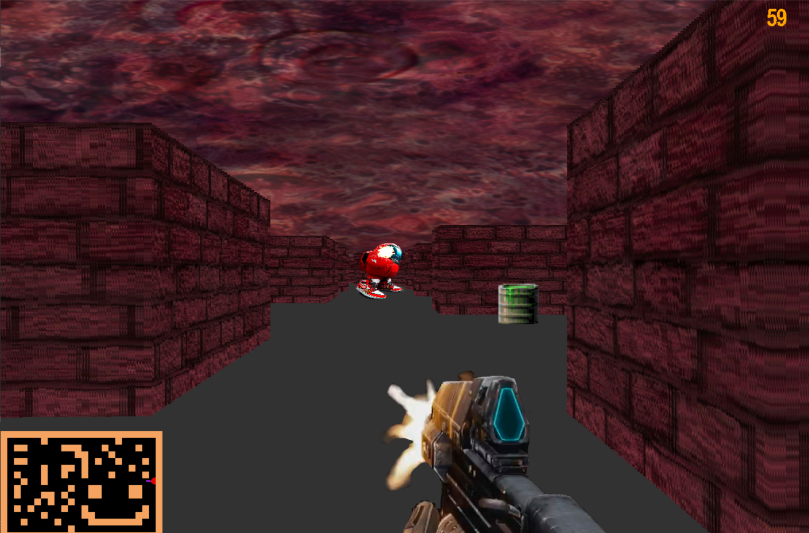
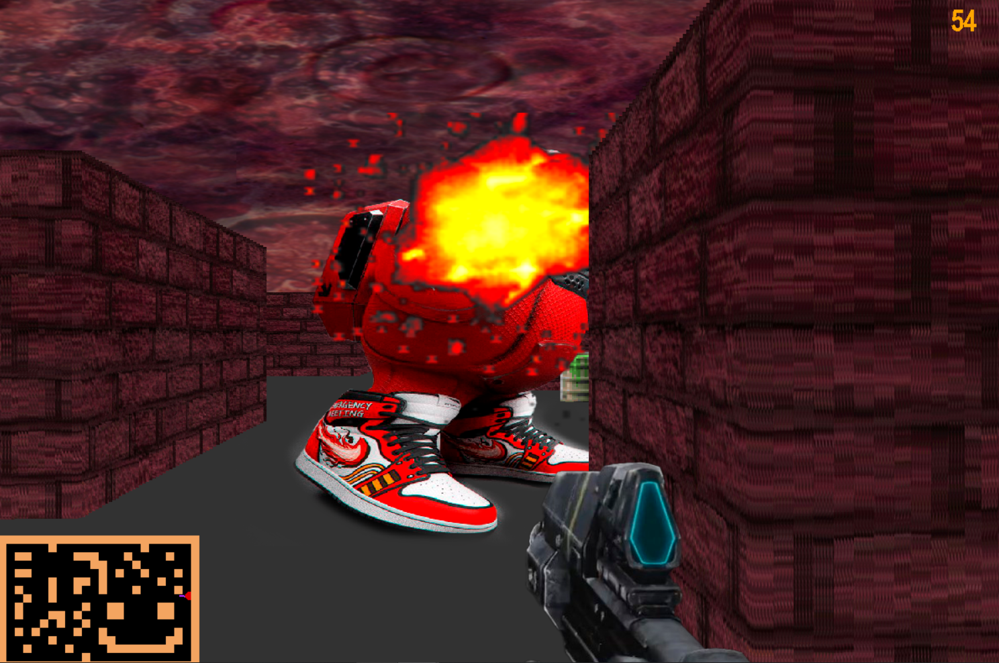

# 3D Game на Python с использованием Pygame

Добро пожаловать в 3D игру на Python, созданную с использованием библиотеки Pygame.

## Установка

Для того чтобы запустить эту игру, вам потребуется установить несколько зависимостей. Вы можете сделать это, выполнив следующие команды в командной строке:

```bash
pip install pygame
```
```bash
pip install numba
```


